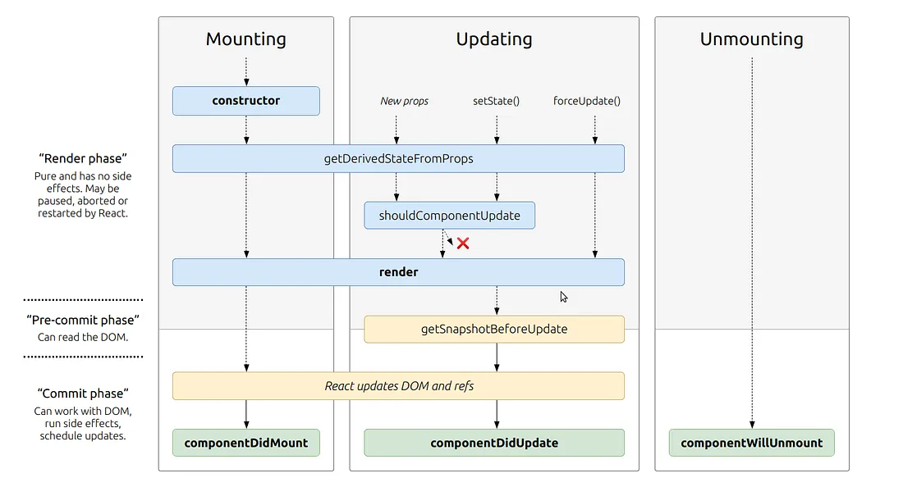

# Class 02

## State and Props

### React Lifecycle

From the diagram above, you can see that components go through three phases:

- Mounting: When an instance is created and inserted into the DOM.
  - This order of events happens when mounting:
    - Constructor, static getDerivedStateFromProps, render, componentDidMount, and UNSAFE_componentWillMount all occur in this order during mounting.
- Updating: Whenever a component is update or its state is changed. Updating rerenders it.
  - This order of events happens when updating:
    - static getDerivedStateFromProps, shouldComponentUpdate, render, getSnapshotBeforeUpdate, componentDidUpdate, UNSAFE_componentWillUpdate, UNSAFE_componentWillReceiveProps.
- Unmounting: The final phase of a component is when it is removed from the DOM.
  - The only event that happens during this phase is componentWillUnmount.

Lifecycle events:

- constructor()
- static getDerivedStateFromProps()
- render()
- componentDidMount()
- shouldComponentUpdate()
- getSnapshotBeforeUpdate()
- componentDidUpdate()
- componentWillUnmount()

[source](https://medium.com/@joshuablankenshipnola/react-component-lifecycle-events-cb77e670a093)

### State vs Props

React allows us to manage data, render that data, and change the render when that data changes. We control these usings states and props.

Props: Handled outside the component. Arguments to a function. When we create components, we pass props to it.  
Props are mainly for things that don't dynamically change:

- Titles, headers, certain types of text.
- Initial values for counters.

State: Handled within the component. Re-renders application when changed.
States are mainly for things that do want to change:

- Form inputs and text that changes based of those forms.
- Updated values for counters.

We use state for information handled within and only within the component. We use props for things that are handled outside and don't change within the component.

## Things I want to know more about
