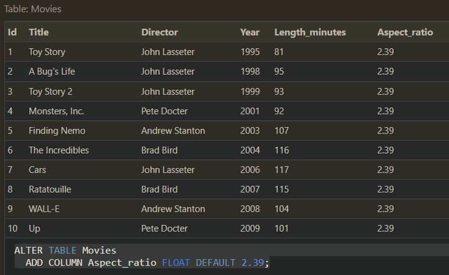

# SQL

SQL, or Structured Query Language, is a widely-used database programming language essential for managing and manipulating data in relational databases. Its popularity stems from its ability to handle a variety of database tasks, making it a fundamental skill for those working with database systems like MySQL, Oracle, SQL Server, and others.

Key capabilities of SQL include:

- Data Manipulation and Management:
  - You can perform various operations such as querying, analyzing, and modifying data in databases. This includes inserting new data, updating existing data, and deleting unwanted data.

- Creating and Modifying Database Structures:
  - SQL allows the creation of new databases and tables, and modification of existing table structures. This is useful for setting up and adjusting databases to meet specific data storage requirements.

- Querying Data:
  - SQL excels in retrieving specific data from databases, allowing for detailed and complex queries to filter and sort data as needed.

- Combining Data from Multiple Tables:
  - Through commands like INNER JOIN and LEFT JOIN, SQL can merge data from different tables, providing a comprehensive view from multiple data sources.

- Database Management:
  - Apart from handling data, SQL is also used for creating views, indexes, and schemas, which are crucial for efficient database management and optimization.

- Accessibility and Standardization:
  - Being an industry-standard language, SQL is compatible with various database management systems, making skills in SQL widely applicable and essential for database professionals.

## Commands

- Data Definition Language (DDL): These commands are used for defining and modifying database schema and structure.
  - CREATE DATABASE: Creates a new database.  
  - CREATE TABLE: Establishes a new table within a database.  
    
  - ALTER TABLE: Modifies the structure of an existing table.  
    
- Data Manipulation Language (DML): These commands are used for managing data within database objects like tables.
  - INSERT: Adds new rows of data to a table.  
    
  - SELECT: Retrieves data from one or more tables.  
    
  - UPDATE: Modifies existing data in a table.  
    
    
  - DELETE: Removes data from a table.  
    
    
- Data Control Language (DCL): Commands used to control access to data in the database.
  - Not specifically covered in the provided text, but typically includes commands like GRANT and REVOKE, which are used to give or take away access rights and permissions.
- Data Querying and Filtering:
  - WHERE: Filters records based on specified conditions.  
    
  - AND, OR, BETWEEN: These are logical operators used within queries to refine search criteria.
- Joining Tables:
  - INNER JOIN: Combines rows from two or more tables based on a related column between them.  
    
  - LEFT JOIN: Returns all rows from the left table, and the matched rows from the right table.
- Data Types:
  - VARCHAR: For storing variable-length character strings.
  - INTEGER: For storing integer (whole number) values.
  - DATE: For storing date values.
